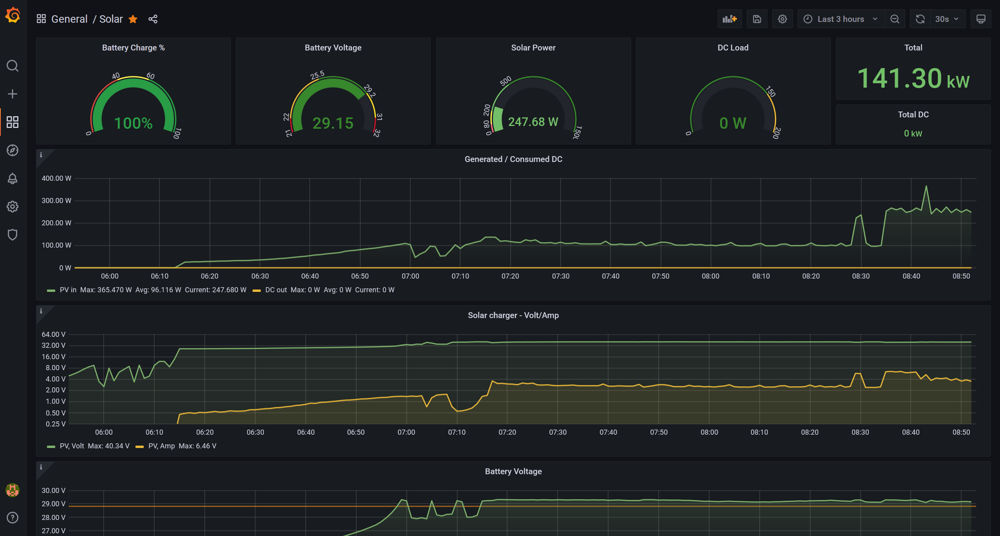
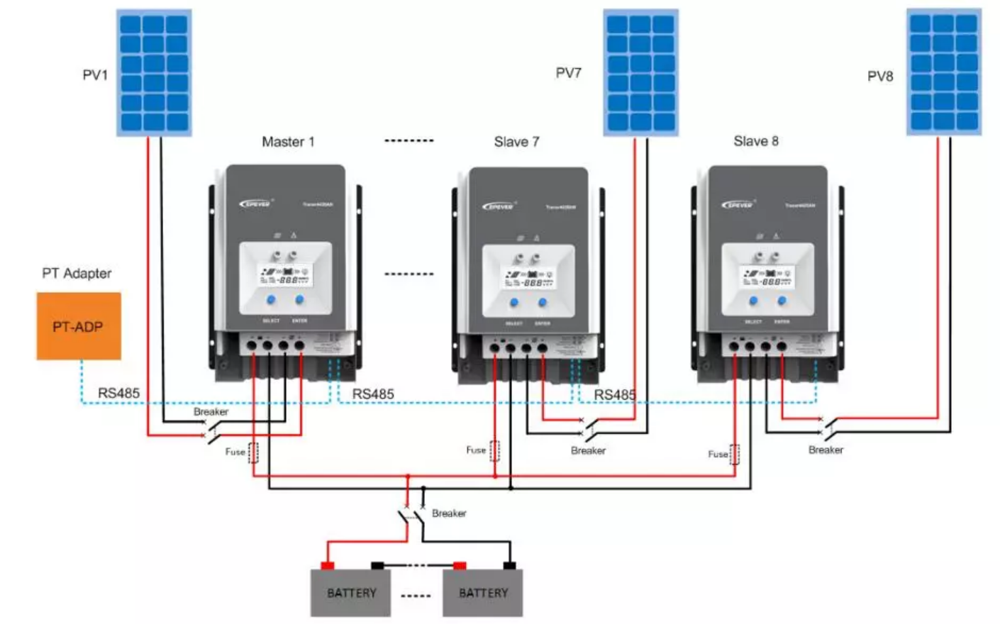

!!! Not maintained anymore !!!
=============================

Monitoring EPsolar Tracer devices via RS-485 with various logging options 
=========================================================================

**EPSolar Tracer** AN/BN devices have been around for a while so this is just another attempt to establish a good monitoring package.
**Supporting multiple controlers** via PAL-ADP Parallel Adapter (up to 6 controllers).

Main features:
* Data logging to DB, file
* Grafana dashboard
* Error logs
* Device communication issues handling
* Multiple charge controllers supported
* Configuration options

## Requirements
- Linux - any distro - Debian, Ubuntu, Raspbian...
- Python 3 (python2 not supported)
- Influx DB and its Python modules
- Grafana
- To communicate with the devices you will need [Minimal Modbus](https://minimalmodbus.readthedocs.io/en/stable/) module for Python
- CC-USB-RS485-150U cable
- PAL-ADP (optional)

Make sure you install the Linux driver for Exar USB UART first
--------------------------------------------------------------
The [xr_usb_serial_common](xr_usb_serial_common-1a/) directory contains the makefile and instructions that will compile properly on Linux. Before compiling be sure to install the linux headers.
Working with newest kernels (tested on 5.13, not working with 5.15)

* xr_serial stock kernel module is not suitable for communication with Epever devices

The resulting `xr_usb_serial_common.ko` file will need to be moved to `/lib/modules/YOUR_LINUX_VERSION/extra/`.
After building and moving the module, remove the xr_serial (cdc-acm on raspbian) that automatically installs for the usb-485 adapter.

You will also need to add the xr_serial (cdc-acm on raspbian) to the system blacklist!

If all goes well you should see `ttyXRUSB` when listing `ls /dev/tty*`

Device communications protocols
-------------------------------
* [Protocol for Epsolar Tracer] Check the pdf in folder: [epsolars-docs/](epsolars-docs/)

Python modules
--------------
Install python modules first:
`pip3 install minimalmodbus influxdb configparser`

Logging scripts
---------------
logtracer.py - this is the main python program collecting the data from Tracer devices. Could be executed from CRON. **Do not execute in interval less then 1 minute**

The program require two parameter in different combinations:

logtracer.py 'connection string' checkname  #console output
  
logtracer.py 'connection string','connection string' filesnap/dbsnap  #/tmp/ep_tracer_{id}.log / influxdb(grafana) (aggregated kW, other stats from first id)
- 'connection string' = tty:device id - example: /dev/ttyXRUSB0:1

* tty - The serial device of your usb modbus cable
* device id - The Tracer devices should have unique id in parallel configuration - from 1 to 6. The default id is 1. For monitoring of multiple devices, separate the IDs with comma 
* check name - Available checks: pvvolt pvamps pvwatt bavolt baamps bawatt batemp baperc bastat eptemp1 eptemp2 epstat dcvolt dcamps dcwatt pvkwhtotal dckwhtotal pvkwhtoday dckwhtoday
* filesnap - write the checks result in /tmp/ep_tracer_id.log (id is a number - the id of the controller
* dbsnap - sending the data to influx db (grafana)

get_tracer.sh - bash script specifically created to parse the data from filesnap function - useful for application integration or trigger creation

**Ensure influx.db is updated before the first use**

Logging options
---------------
InfluxDB - used for Grafana visualization (for multiple devices, the watt data is aggregated)

File - separate file for each controller in dictionary structured format - to process or to integrate the data with other systems

Single registry check (volt, amp...) - mainly for testing

Grafana Dashboard
-----------------
Some very basic knowledge of InfluxDB and Grafana is assumed here.

The [grafana/](grafana/) folder contains the dashboard to monitor realtime and historical solar charging data.

## Grafana/InfluxDB installation

Use [this guide](https://simonhearne.com/2020/pi-influx-grafana/) to install InfluxDB and Grafana on Raspberry Pi (applicable for any Debian based distro)

Run http://local.ip:3000 to configure the Grafana console

When you add InfluxDB as a Data Source. Influx DB should be set up with the following parameters:

- user = "grafana"
- pass = "solar"
- db   = "solar"
- host = "127.0.0.1"
- port = 8086

At this point you can also import SolarDashboard from [grafana/](grafana/) folder.

Use "solar" dataset to import the values from when setting up the console.

## Make Grafana dashboard public

Check folder [www/](www/) for details

Multiple Tracer chargers in parallel - configuration
----------------------------------------------------

Known BUGS
----------
Communication issues could occure in parallel configuraion. Assumption - the bus is busy during the communication between Tracer devices. PAL-ADP regularly check the connected devices if necessary to adjust the charging parameters. In case of such scenario the script is returning -2 which could create artefacts in your graphs. At the moment this is mitigated with error handling and timeouts - reducing these cases to minimum.

* Fixing Grafana DB - [fix_influx.sh](fix_influx.sh) is a script which will fix the db in case of communication issues as result of the mentioined known bug

Issue with PVwatt calculation in Tracer 5415an.
Not clear if this is related to specific firmware version - PVwatt register contain incorrect value if the PV current usage (PVamps register) is above 20A.

* Fix: added new influxdb field in measurement solar_(*) (PVwattfix) as product of PVamps and PVvolt. This is a dummy fix but gives relatively correct value. Grafana users need to update the graph sql statement to point the new field instead of PVwatt.

Latest Changes
--------------
What is changed in ver 1.1:

Connection string to EPever device require TTY togather with id - /dev/ttyXRUSB0:1

InfluxDB statistics modes added:

aggregate - collect the data from all controllers in one measurement defined in Measurement_pref (influx.db configuration file)

individial - separate influxdb measurements:  Measurement_pref+_(id) - example: solar_1, solar_2
  
